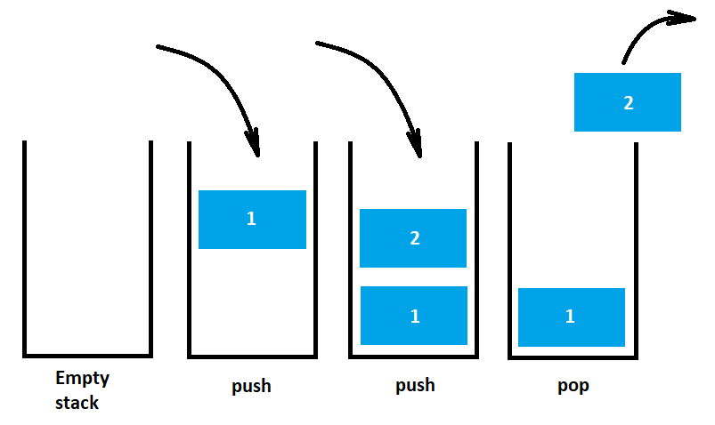

# Data structures

[Introduction](#introduction)<br>
[Stack](#stack)<br>

## <a name="introduction">Introduction</a>
Data structure is a storage that is used to store and organize data. It is a way of arranging data on a computer so that it can be accessed and updated efficiently

Basically, data structures are divided into two categories:
   - Linear data structure
   - Non-linear data structure

In **linear data structures**, the elements are **arranged in sequence** one after the other. Since elements are arranged in particular order, they are easy to implement. Popular linear data structures are **array**, **stack**, **queue**, **linked list**.

However, when the complexity of the program increases, the linear data structures might not be the best choice because of operational complexities.

Unlike linear data structures, elements in **non-linear data structures** are not in any sequence. Instead they are **arranged in a hierarchical manner** where one element will be connected to one or more elements.

**Non-linear data structures** are further divided into **graph** and **tree** based data structures.

## <a name="stack">Stack</a>
A stack is a linear data structure. It works on the discipline of LIFO i.e. Last in First Out, as shown in the figure below.



The most common uses of a stack are:
   - evaluating expressions consisting of operands and operators
   - Backtracking, i.e., to check parenthesis matching in an expression
   - To convert one form of expression to another form
   - For systematic Memory Management

Here, the stack is implemented using an array under the hood. It supports the basic operations that are:
   - **Push**: Add an element to the top of a stack
   - **Pop**: Remove an element from the top of a stack
   - **IsEmpty**: Check if the stack is empty
   - **Peek**: Get the value of the top element without removing it

   ### Operation time complexity

| Operation     |   Complexity  |
| ------------- | ------------- |
| push()        |      O(1)     |
| pop()         |      O(1)     |
| isEmpty()     |      O(1)     |
| peek()        |      O(1)     |

### Creat a stack
```javascript
   const fruits = new Stack();
```
### Add an element to the stack
This example uses the `push()` method to add new elements to the fruits stack
```javascript
   fruits.push('Apple'); // 1 - returns actual stack size
   fruits.push('Pear'); // 2
```
### Remove an element from the stack
This example uses the `pop()` method to remove the last element from the fruits stack
```javascript
   fruits.pop(); // Pear - returns removed element
   fruits.pop(); // Apple
   fruits.pop(); // null - the stack is empty
```
### Check if the stack is empty
This example uses the `isEmpty()` method to check if there are no elements in the fruits stack
```javascript
   fruits.isEmpty(); // true
   fruits.push('Apple'); // 1
   fruits.isEmpty(); // false
   fruits.pop(); // Apple
   fruits.isEmpty(); // true
```
### Get the value of the top element without removing it
This example uses the `peek()` method to get the value of the top element in the fruits stack without removing it
```javascript
   fruits.peek(); // null - the stack is empty
   fruits.push('Apple'); // 1
   fruits.push('Pear'); // 2
   fruits.peek(); // Pear
   fruits.pop(); // Pear
   fruits.peek(); // Apple
   fruits.pop(); // Apple
   fruits.peek(); // null
```
