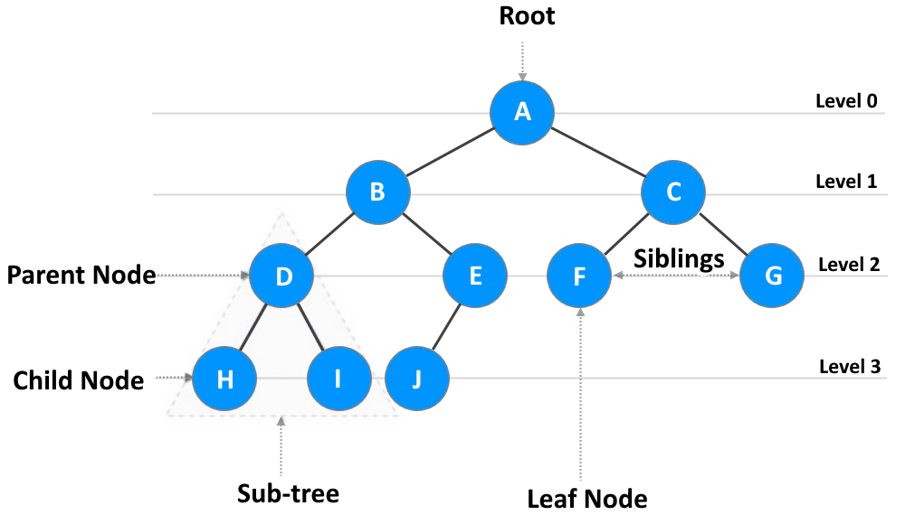
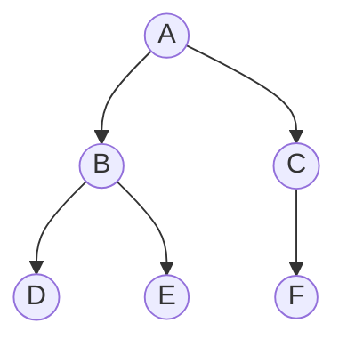
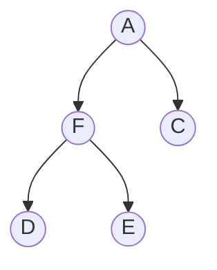

## Binary tree

A tree is a non-linear hierarchical data structure that represents the nodes connected by edges.

The most common uses of a tree are:
   - Performing easy and quick access to data
   - Implementation of heap data structure
   - Implementation of router algorithms
   - Implementation of syntax tree

Binary Tree is a special datastructure used for data storage purposes. A binary tree has a special condition that each node can have a maximum of two children. A binary tree has the benefits of both an ordered array and a linked list as search is as quick as in a sorted array and insertion or deletion operation are as fast as in linked list.



Important Terms:
   - **Path** − Path refers to the sequence of nodes along the edges of a tree.
   - **Root** − The node at the top of the tree is called root. There is only one root per tree and one path from the root node to any node.
   - **Edge** - It is the link between any two nodes.
   - **Height of a Node** - The height of a node is the number of edges from the node to the deepest leaf (ie. the longest path from the node to a leaf node).
   - **Depth of a Node** - The depth of a node is the number of edges from the root to the node.
   - **Height of a Tree** - The height of a Tree is the height of the root node or the depth of the deepest node.
   - **Degree of a Node** - The degree of a node is the total number of branches of that node.
   - **Parent** − Any node except the root node has one edge upward to a node called parent.
   - **Child** − The node below a given node connected by its edge downward is called its child node.
   - **Leaf** − The node which does not have any child node is called the leaf node.
   - **Subtree** − Subtree represents the descendants of a node.
   - **Visiting** − Visiting refers to checking the value of a node when control is on the node.
   - **Traversing** − Traversing means passing through nodes in a specific order.
   - **Levels** − Level of a node represents the generation of a node. If the root node is at level 0, then its next child node is at level 1, its grandchild is at level 2, and so on.
   - **keys** − Key represents a value of a node based on which a search operation is to be carried out for a node.

Here, the binary tree implemented. It supports the basic operations that are:
   - **Insert** − Add an element to the tree
   - **Search** − Search an element in the tree
   - **Delete** - Delete an element in the tree
   - **Pre-order Traversal** − Traverse the tree in a pre-order manner
   - **In-order Traversal** − Traverse the tree in an in-order manner
   - **Pos-torder Traversal** − Traverse the tree in a post-order manner
   - **Level-order Traversal** − Traverse the tree in a level-order manner

### Operation time complexity

| Operation             |   Complexity      |
| --------------------- | ----------------- |
| insert()              |      O($n^{2}$)   |
| search()              |      O(n)         |
| delete()              |      O($n^{2}$)   |
| traversePreOrder()    |      O(n)         |
| traverseInOrder()     |      O(n)         |
| traversePostOrder()   |      O(n)         |
| traverseLevelOrder()  |      O($n^{2}$)   |

### Creat a tree
```javascript
   const myTree = new BinaryTree();
```
### Add an element to the tree
This example uses the `insert()` method to add new elements to the myTree in level order
```javascript
myTree.insert('A');
myTree.insert('B');
myTree.insert('C');
myTree.insert('D');
myTree.insert('E');
myTree.insert('F');
```


### Search an element in the tree
This example uses the `search()` method to find an element int the myTree
```javascript
   myTree.search('H'); // null - there is no such node in the tree
   myTree.search('C');
   // BinaryNode {
   // key: 'C',
   // left: BinaryNode { key: 'F', left: null, right: null },
   // right: null
   // }
```
### Traverse the tree in a pre-order manner
This example uses the `traversePreOrder()` method to traverse the myTree in a pre-order manner
```javascript
   myTree.traversePreOrder(myTree.root, (node) => console.log(node.key));
   // A B D E C F
```
### Traverse the tree in an in-order manner
This example uses the `traverseInOrder()` method to traverse the myTree in an in-order manner
```javascript
   myTree.traverseInOrder(myTree.root, (node) => console.log(node.key));
   // D B E A F C
```
### Traverse the tree in an post-order manner
This example uses the `traversePostOrder()` method to traverse the myTree in a post-order manner
```javascript
   myTree.traversePostOrder(myTree.root, (node) => console.log(node.key));
   // D E B F C A
```
### Traverse the tree in a level-order manner
This example uses the `traverseLevelOrder()` method to traverse the myTree in a level-order manner
```javascript
   myTree.traverseLevelOrder(myTree.root, (node) => console.log(node.key));
   // A B C D E F
```
### Delete an element in the tree
This example uses the `delete()` method to remove an element from the myTree
```javascript
   myTree.delete('H'); // false - there is no such node in the tree
   myTree.delete('B'); // true - the node 'B' was replaced with the very last node of the tree and deleted
   myTree.traverseLevelOrder(myTree.root, (node) => console.log(node.key));
   // A F C D E
```


## Binary search tree (BST)

Binary search tree is a data structure that quickly allows us to maintain a sorted list of numbers.

The properties that separate a binary search tree from a regular binary tree are:
   - the value of the key of the left sub-tree is less than the value of its parent (root) node's key;
   - the value of the key of the right sub-tree is greater than or equal to the value of its parent (root) node's key.

### Operation time complexity

| Operation             |   Complexity      |
| --------------------- | ----------------- |
| insert()              |      O(n)         |
| search()              |      O(n)         |
| delete()              |      O(n)         |
| traversePreOrder()    |      O(n)         |
| traverseInOrder()     |      O(n)         |
| traversePostOrder()   |      O(n)         |
| traverseLevelOrder()  |      O($n^{2}$)   |


## AVL tree

AVL tree is a self-balancing binary search tree. It got its name after its inventor Georgy Adelson-Velsky and Landis.

The self balancing property of an avl tree is maintained by the balance factor.

Balance factor of a node in an AVL tree is the difference between the height of the left subtree and that of the right subtree of that node. The value of balance factor should always be -1, 0 or +1.

### Operation time complexity

| Operation             |   Complexity      |
| --------------------- | ----------------- |
| insert()              |      O(log n)     |
| search()              |      O(log n)     |
| delete()              |      O(log n)     |
| traversePreOrder()    |      O(n)         |
| traverseInOrder()     |      O(n)         |
| traversePostOrder()   |      O(n)         |
| traverseLevelOrder()  |      O($n^{2}$)   |
