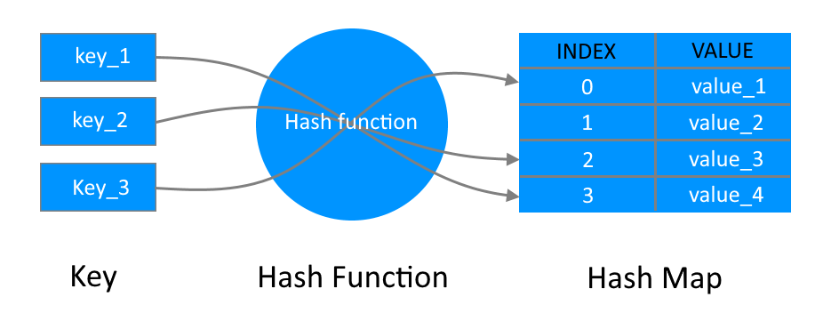

## Hashmap

HashMap is a data structure which stores data in an associative manner. In a HashMap, data is stored in an array format, where each data value has its own unique index value. Access of data becomes very fast if we know the index of the desired data.

Thus, it becomes a data structure in which insertion and search operations are very fast irrespective of the size of the data. HashMap uses an array as a storage medium and uses **hashing** technique to generate an index where an element is to be inserted or is to be located from.

**Hashing** is a technique to convert a range of key values into a range of indexes of an array.



It may happen that the hashing technique is used to create an already used index of the array. This is called a **hash collision**.
We can resolve the hash collision using one of the following techniques:
   - Collision resolution by chaining
   - Open Addressing: Linear/Quadratic Probing and Double Hashing

In **chaining**, if a hash function produces the same index for multiple elements, these elements are stored in the same index by using a linked list.

In **linear probing**, collision is resolved by checking the next slot until find an empty one. The problem with linear probing is that a cluster of adjacent slots is filled. When inserting a new element, the entire cluster must be traversed. This adds to the time required to perform operations on the hash table.

**Quadratic Probing** works similar to linear probing. It operates by taking the original hash index and adding successive values of an arbitrary quadratic polynomial until an open slot is found.

Using **double hashing** if a collision occurs after applying a hash function h(k), then another hash function is calculated for finding the next slot.

Hashing uses **hash functions** (which is some mathematical formula) to calculate the hash code which acts as the index of the data structure where the value will be stored.
There are many hash functions that use numeric or alphanumeric keys.

A good hash function should have the following properties:
   - Efficiently computable
   - Should uniformly distribute the keys (Each table position is equally likely for each
   - Should minimize collisions
   - Should have a low load factor(number of items in the table divided by the size of the table)

Complexity of calculating hash value using the hash function:
   - Time complexity: O(n)
   - Space complexity: O(1)

The most common uses of a hashmap are:
   - indexing in databases
   - in disk-based data structures
   - In some programming languages like Python, JavaScript hash is used to implement objects
   - cache mapping for fast access to the data
   - password verification

Here, the hashmap is implemented using an array under the hood and linear probing to solve the collisions. It supports the basic operations that are:
   - **Search**: Find an element in the hashmap
   - **Insert**: Add an element to the hashmap
   - **Delete**: Remove an element from the hashmap
   - **Clear**: Remove all of the elements from the map
   - **GetSize**: Return the number of entries in the map
   - **isEmpty**: Check if the map is empty

   ### Operation time complexity

| Operation     |   Complexity  |
| ------------- | ------------- |
| search()      |      O(n)     |
| insert()      |      O(n)     |
| delete()      |      O(n)     |
| clear()       |      O(n)     |
| getSize()     |      O(1)     |
| isEmpty()     |      O(1)     |

### Creat a hashmap
```javascript
   const myHasmap = new Hashmap(8); // creates hashmap of size 8 (16 by default if no argument was passed)
```
### Add an element to the hashmap
This example uses the `insert()` method to add new elements to the myHashmap
```javascript
   myHasmap.insert(1, 'a'); // 'a'
   myHasmap.insert(2, 'b'); // 'b'
   myHasmap.insert(3, 'c'); // 'c'
```

### Find an element in the hashmap
This example uses the `search()` method to find an elemen in the myHashmap
```javascript
   myHasmap.search(2); // 'b'
   myHasmap.search(4); // null - element not found
```
### Remove an element from the hashmap
This example uses the `delete()` method to remove an element from the myHashmap
```javascript
  myHasmap.delete(3); // 'c'
  myHasmap.delete(4); // null - the element with key 4 was not found
```
### Get the number of entries in the map
This example uses the `getSize()` method to get the number of elements in the myHashmap
```javascript
  myHasmap.getSize(); // 2
```
### Remove all of the elements from the map
This example uses the `clear()` method to remove all of the elements from the myHashmap
```javascript
  myHasmap.clear();
  myHasmap.getSize(); // 0
```
### Check if the map is empty
This example uses the `isEmpty()` method to check if the the myHashmap is empty
```javascript
  myHasmap.isEmpty(); // true
  myHasmap.insert(1, 'a'); // 'a'
  myHasmap.isEmpty(); // false
```
