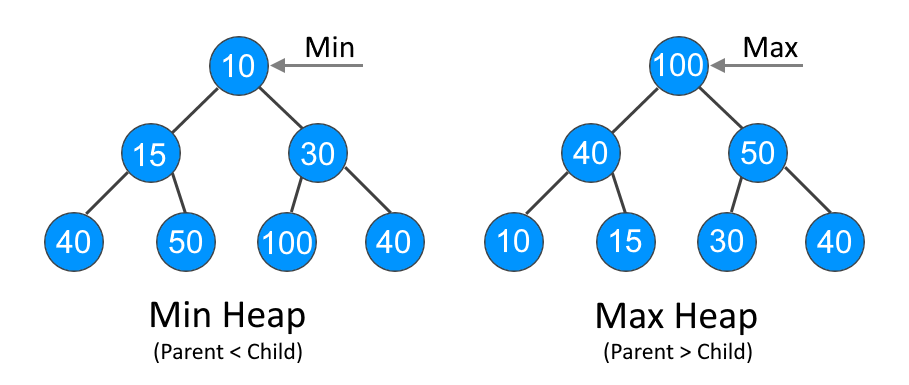

## Heap

A Heap is a special Tree-based Data Structure in which the tree is a complete binary tree. This property of Binary Heap makes them suitable to be stored in an array.
The root element will be at Arr[0].
Below table shows indexes of other nodes for the ith node, i.e., Arr[i]:

| Element      | Description                  |
| ------------ | ---------------------------- |
| Arr[(i-1)/2] | Returns the parent node      |
| Arr[(2*i)+1] | Returns the left child node  |
| Arr[(2*i)+2] | Returns the right child node |

Generally, heaps are of two types:
   - **Max-Heap** - In this heap, the value of the root node must be the greatest among all its child nodes and the same thing must be done for its left and right sub-tree also.
   - **Min-Heap** - In this heap, the value of the root node must be the smallest among all its child nodes and the same thing must be done for its left ans right sub-tree also.




The most common uses of a heap are:
   - Heap Sort: Heap Sort uses Binary Heap to sort an array in O(nLogn) time
   - Priority Queues: Priority queues can be efficiently implemented using Binary Heap because it supports insert(), delete() and extractmax(), decreaseKey() operations in O(log N) time
   - Binomial Heap and Fibonacci Heap are variations of Binary Heap. These variations perform union also in O(log N) time which is an O(N) operation in Binary Heap
   - Order statistics: The Heap data structure can be used to efficiently find the kth smallest (or largest) element in an array

Here, the max-heap is implemented using an array under the hood. It supports the basic operations that are:
   - **Insert** − Add an element to the heap
   - **Delete** - Return and remove the root element in the heap
   - **Peek**: Get the value of the root element without removing it

   ### Operation time complexity

| Operation     |   Complexity  |
| ------------- | ------------- |
| insert()      |      O(log n) |
| delete()      |      O(log n) |
| peek()        |      O(1)     |

### Creat a heap
```javascript
   const minHeap = new Heap(); // creates Min-Heap by default or when HeapType.MAX passed as a parameter
   // pass HeapType.MAX as a parameter to create Max-Heap instead
```
### Add an element to the heap
This example uses the `insert()` method to add new elements to the heap
```javascript
   minHeap.insert(10); // [10]
   minHeap.insert(40); // [10, 40]
   minHeap.insert(30); // [10, 40, 30]
   minHeap.insert(15); // [10, 15, 30, 40]
   minHeap.insert(50); // [10, 15, 30, 40, 50]
```
### Return and remove the root element in the heap
This example uses the `delete()` method to return and remove the root element from the heap
```javascript
   minHeap.delete(); // 10
   minHeap.delete(); // 15
   minHeap.delete(); // 30
   // [40, 50]
```
### Get the value of the root element without removing it
This example uses the `peek()` method to get the value of the root element without removing it
```javascript
   minHeap.peek(); // 40
   minHeap.delete(); // 40
   minHeap.delete(); // 50
   minHeap.delete(); // null - the heap is empty
   minHeap.peek(); // null - the heap is empty
```
