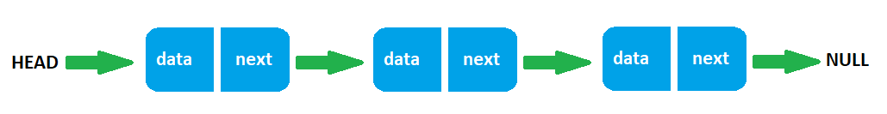

## Linked List
A linked list is a linear data structure that includes a series of connected nodes. Here, each node stores the data and the address of the next node, e.c.,



The address of the first node has special name `head`.Also, the last node in the linked list addresses to `null`.

The most common uses of a linked list are:
   - Implementation of stacks and queues
   - Implementation of graphs: Adjacency list representation of graphs is the most popular which uses a linked list to store adjacent vertices.
   - Dynamic memory allocation: We use a linked list of free blocks.
   - Maintaining a directory of names
   - Performing arithmetic operations on long integers
   - Manipulation of polynomials by storing constants in the node of the linked list
   - Representing sparse matrices


Linked lists can be of multiple types: **singly**, **doubly**, and **circular** linked list.

Here, the singly linked list implemented. It supports the basic operations that are:
   - **AddFirst**: Add an element to the beginning of the list
   - **AddLast**: Add an element to the end of the list
   - **RemoveFirst**: Remove an element from the beginning of the list
   - **RemoveLast**: Remove an element from the end of the list
   - **GetFirst**: Get the element at the beginning of the list
   - **GetLast**: Get the element at the end of the list
   - **Size**: Return the number of elements in the list
   - **Clear**: Delete all the elements from the list
   - **ToArray**: Convert the LinkedList to an array containing all list elements in proper sequence
   - **Contains**: Check if the element is presented in the list
   - **Find**: Find the element in the list by its value
   - **Remove**: Remove the element from the list by its value

### Operation time complexity

| Operation     |   Complexity  |
| ------------- | ------------- |
| addFirst()    |      O(1)     |
| addLast()     |      O(n)     |
| removeFirst() |      O(1)     |
| removeLast()  |      O(n)     |
| getFirst()    |      O(1)     |
| getLast()     |      O(n)     |
| size()        |      O(n)     |
| clear()       |      O(1)     |
| toArray()     |      O(n)     |
| contains()    |      O(n)     |
| find()        |      O(n)     |
| remove()      |      O(n)     |

### Creat a linked list
```javascript
   const fruits = new LinkedList();
```
### Add an element to the beginning of the list
This example uses the `addFirst()` method to add new elements to the fruits list
```javascript
   fruits.addFirst('Apple');
   fruits.addFirst('Pear');
   // Pear, Apple
```
### Add an element to the end of the list
This example uses the `addLast()` method to add new elements to the fruits list
```javascript
   fruits.addLast('Mango');
   // Pear, Apple, Mango
```
### Get the element at the beginning of the list
This example uses the `getFirst()` method to get the element at the beginning of the fruits list
```javascript
   fruits.getFirst(); // Pear
```
### Get the element at the end of the list
This example uses the `getLast()` method to get the element at the end of the fruits list
```javascript
   fruits.getLast(); // Mango
```
### Remove an element from the beginning of the list
This example uses the `removeFirst()` method to remove an element from the beginning of the fruits list
```javascript
   fruits.removeFirst(); // Pear
```
### Remove an element from the end of the list
This example uses the `removeLast()` method to remove an element from the end of the fruits list
```javascript
   fruits.removeLast(); // Mango
```
### Return the number of elements in the list
This example uses the `size()` method to return the number of elements in the fruits list
```javascript
   fruits.size(); // 1
  fruits.addFirst('Banana');
  fruits.addFirst('Mango');
  fruits.size(); // 2
```
### Convert the LinkedList to an array
This example uses the `toArray()` method to convert the fruits list to an array containing all list elements in proper sequence
```javascript
   fruits.toArray(); // [Mango, Banana, Apple]
```
### Check if the element is presented in the list
This example uses the `contains()` method to check if the element is presented in the fruits list
```javascript
   fruits.contains('Apple'); // true
   fruits.contains('Pear'); // false
```
### Find the element in the list by its value
This example uses the `find()` method to find the element in the fruits list its value
```javascript
   fruits.find('Apple'); // Node { data: 'Apple', next: null }
   fruits.find('Pear'); // null
```
### Remove the element from the list by its value
This example uses the `remove()` method to remove an element from the fruits list by its value
```javascript
   fruits.remove('Mango'); // true
   fruits.remove('Pear'); // false
```
### Delete all the elements from the list
This example uses the `clear()` method to delete all the elements from the fruits list
```javascript
   fruits.clear();
   fruits.size(), // 0
   fruits.getFirst(), // null
   fruits.getLast(), // null
   fruits.removeFirst(), // null
   fruits.removeLast(), // null
   fruits.toArray(); // []
```
