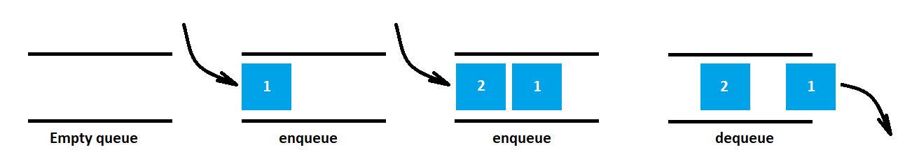

## Queue
A queue is a linear data structure. It works on the discipline of FIFO i.e. First in First Out, as shown in the figure below.



The most common uses of a queue are:
   - Scheduling
   - Buffering

Here, the queue is implemented using an array under the hood. It supports the basic operations that are:
   - **Enqueue**: Add an element to the end of the queue
   - **Dequeue**: Remove an element from the front of the queue
   - **IsEmpty**: Check if the queue is empty
   - **Peek**: Get the value of the first element without removing it

### Operation time complexity

| Operation     |   Complexity  |
| ------------- | ------------- |
| enqueue()     |      O(1)     |
| dequeue()     |      O(n)     |
| isEmpty()     |      O(1)     |
| peek()        |      O(1)     |

### Creat a queue
```javascript
   const fruits = new Queue();
```
### Add an element to the queue
This example uses the `enqueue()` method to add new elements to the fruits queue
```javascript
   fruits.enqueue('Apple'); // 1 - returns actual queue size
   fruits.enqueue('Pear'); // 2
```
### Remove an element from the queue
This example uses the `dequeue()` method to remove the last element from the fruits queue
```javascript
   fruits.dequeue(); // Pear - returns removed element
   fruits.dequeue(); // Apple
   fruits.dequeue(); // null - the queue is empty
```
### Check if the queue is empty
This example uses the `isEmpty()` method to check if there are no elements in the fruits queue
```javascript
   fruits.isEmpty(); // true
   fruits.enqueue('Apple'); // 1
   fruits.isEmpty(); // false
   fruits.dequeue(); //Apple
   fruits.isEmpty(); // true
```
### Get the value of the top element without removing it
This example uses the `peek()` method to get the value of the top element in the fruits queue without removing it
```javascript
   fruits.peek(); // null
   fruits.enqueue('Apple'); // 1
   fruits.enqueue('Pear'); // 2
   fruits.peek(); // Apple
   fruits.dequeue(); // Apple
   fruits.peek(); // Pear
   fruits.dequeue(); // Pear
   fruits.peek(); // null
```
